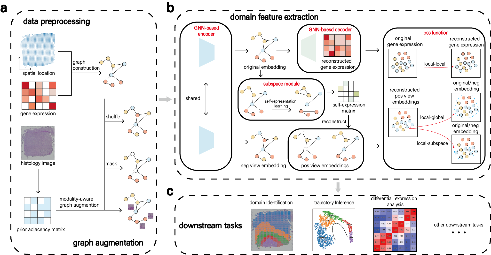

# GRAS4T: Spatial domains identification in spatial transcriptomics by domain knowledge-aware and subspace-enhanced graph contrastive learning




Spatial transcriptomics (ST) technologies have emerged as an effective tool to identify the spatial architecture of the tissue, facilitating a comprehensive understanding of organ function and tissue microenvironment. Spatial domain identification is the first and most critical step in ST data analysis, which requires thoughtful utilization of tissue microenvironment and morphological priors. To this end, we propose a graph contrastive learning framework, GRAS4T, which combines contrastive learning and subspace module to accurately distinguish different spatial domains by capturing tissue microenvironment through self-expressiveness of spots within the same domain. To uncover the pertinent features for spatial domain identification, GRAS4T employs a graph augmentation based on histological images prior, preserving information crucial for the clustering task. Experimental results on 8 ST datasets from 5 different platforms show that GRAS4T outperforms five state-of-the-art competing methods in spatial domain identification. Significantly, GRAS4T excels at separating distinct tissue structures and unveiling more detailed spatial domains. GRAS4T combines the advantages of subspace analysis and graph representation learning with extensibility, making it an ideal framework for ST domain identification.

## Environment installation 

**Note**: The current version of GRAS4T supports Linux and Windows platform. 


This code was tested with python 3.8, cuda 11.1, PyTorch 1.8.0, and torch_geometrics 2.4.0


Install packages listed on a pip file:
```
pip install -r requirements.txt
```

Install `rpy2` package:
```
pip install rpy2==3.5.10
```
Please note that the R language and the mclust package need to be installed on your system.

Install the corresponding versions of pytorch and torch_geometrics:

```
pip install torch==1.8.0+cu111 torchvision==0.9.0+cu111 torchaudio==0.8.0 -f https://download.pytorch.org/whl/torch_stable.html
pip install torch-geometric==2.4.0
```

## Run the code

All code is currently launched through `python main.py`. We provide the slice 151507 of the DLPFC dataset for the model. Run the following code for testing:

```
python main.py --have_label True
```

If you want to use GRAS4T in other datasets, please change the `platform`, `dataset_name` and `slice` parameters. Check main.py for overriding default parameters.

The ST datasets supporting the findings of this study are available at https://doi.org/10.5281/zenodo.11179169.

